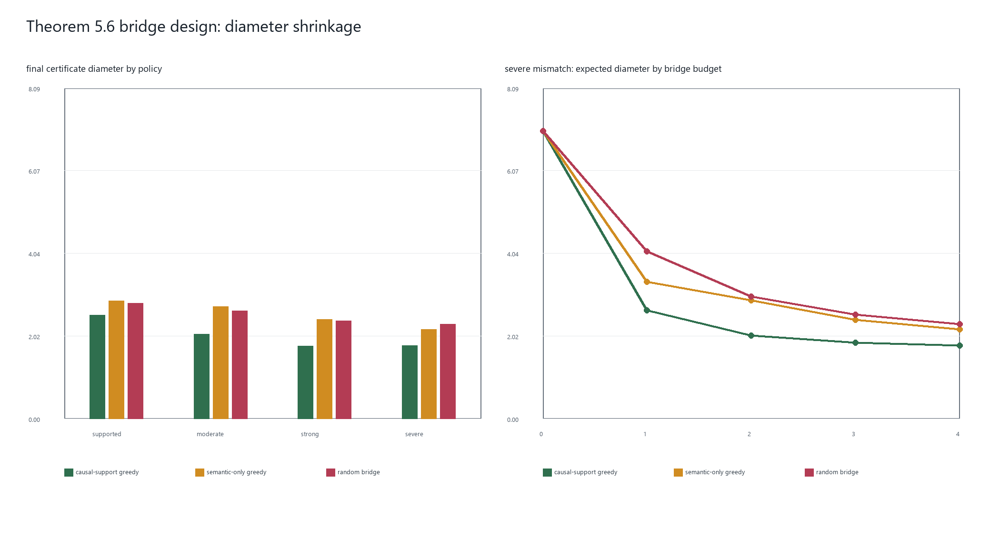

# 阶段11：Bridge 实验设计

## 在 Algorithm 1 中的位置

本阶段严格对应 Algorithm 1 第 10--15 行、Definition 5.2 和 Theorem 5.6。
`run_algorithm1(...)` 先执行阶段 3 的组合与拒绝判断；只有 Theorem 5.1 证书超过
科学容忍度时，才构造阶段 9 的 Theorem 5.4 区间并启动 bridge。接受分支不会
选择 bridge。

阶段 11 为了专门检验拒绝分支，把 `support_tolerance` 固定为 0，确保所有模拟
target 都进入 bridge 设计。这个设置是实验隔离手段，不是实际应用中建议的科学
容忍度。

## 第一步：得到当前部分识别区域

程序先用当前 archive 构造

\[
\widehat\Theta_A(e_\star)
=\bigcap_{\alpha\in W_A(e_\star)}
\left[
\sum_j\alpha_j\widehat\tau_j-B(\alpha,\zeta_\alpha),
\sum_j\alpha_j\widehat\tau_j+B(\alpha,\zeta_\alpha)
\right].
\]

这个交集的直径是 bridge 设计真正要缩小的对象，不再使用单候选距离或
Theorem 5.1 半径代理。

## 第二步：为未来 bridge 结果声明规划模型

候选尚未运行时，它的未来效应估计未知，所以 Definition 5.2 要对未来结果取
期望。本实验公开声明以下可复现规划模型：

1. 用当前公开 archive 对候选的公开表示运行 ATLAS，得到候选效应的 plug-in
   预测均值；
2. 若候选支持不足而没有可用预测，就退回当前 archive 效应估计的均值；
3. 令未来 bridge 估计服从以该预测为均值、候选设计标准误 0.10 为标准差的正态
   分布；
4. 使用 3 点 Gauss-Hermite 求积，对每个假想结果重建 Theorem 5.4 交集并计算
   期望直径。

这不是论文指定的唯一预测分布；论文定义了期望型 VoI，但没有给出本仿真的未来
结果先验。因此正态 plug-in 模型是本项目明确公开的数值实例化，而不是隐藏调参。

## 第三步：计算当前集合条件下的边际 VoI

设已经选择并观测的 bridge 集合是 (S_{b-1})。对每个尚未选择的候选 (u)，程序
计算

\[
\widehat{\operatorname{VoI}}(u\mid S_{b-1})
=\operatorname{diam}\widehat\Theta_{A\cup S_{b-1}}(e_\star)
-\mathbb E_u\left[
\operatorname{diam}
\widehat\Theta_{A\cup S_{b-1}\cup\{u\}}(e_\star)
\right].
\]

选择边际值最大的候选以后，它的模拟 `observed_effect` 才进入 archive。下一轮会
基于扩展后的 archive 重新预测剩余候选、重新积分和重新排序。因此第 2、3、4 个
bridge 都条件于前面已经选择并观测的集合，不是预先排好的一张固定榜单。

选择时不读取 target 真值、target 真实机制、候选真实效应或候选真实机制。这些
oracle 变量仅在策略结束后计算真实机制凸包距离和 bridge 测量误差。

## 第四步：候选库与三种策略

每个 target 附近生成 12 个候选：4 个四维都接近的 `causal_full`、4 个只在
((s_1,s_2)) 上接近的 `semantic_trap`、4 个四维中等偏移的 `mixed`。

| 策略 | 规划时使用的公开坐标 | 选择规则 |
| --- | --- | --- |
| causal-support greedy | ((s_1,s_2,h_{proxy},q)) | 每轮最大化条件边际期望直径缩减 |
| semantic-only greedy | 仅 ((s_1,s_2)) | 在纯语义表示下最大化同一个条件边际目标 |
| random bridge | 不计算 VoI | 从剩余候选均匀随机选择 |

三种策略最终都用完整四维表示重算评价区间，保证结果处于同一尺度。边际值可加入
绝对值不超过 0.01 的均匀误差，用来实例化 Theorem 5.6 的估计误差条件。

## 第五步：处理空交集

Lemma 5.1 规定：Theorem 5.4 交集为空，表示 archive 估计和声明证书在当前置信
水平下相互不一致。空集的直径不是 0，不能当成“完美收缩”。实现把这种状态记为
未定义直径并停止当前直径型规划，同时单独汇报：

- `budget_completion_rate`：真正选满 4 个 bridge 的路径比例；
- `mean_selected_bridge_count`：实际平均选择数；
- `planning_inconsistency_rate`：规划表示下出现空交集的比例；
- `evaluation_inconsistency_rate`：完整四维评价交集出现空集的比例。

绘图时，提前停止路径在后续预算位置保持最后一个仍有定义的评价直径；它不会被
补成 0，也不会被算作额外缩减。

## 固定实验协议

- support shift：0、0.25、0.60、0.80；
- archive 数量：8；候选数量：12；预算：4；
- bridge 标准误：0.10；Gauss-Hermite 节点：3；
- 独立种子：20261111、20261112、20261113；
- 每个种子、每个场景重复 100 次；
- 1,200 个 target，3,600 条策略路径。

## 正式结果

| 场景 | 策略 | 完成率 | 规划不一致率 | 初始直径 | 最终直径 | 缩减比例 |
| --- | --- | ---: | ---: | ---: | ---: | ---: |
| supported | causal greedy | 1.0000 | 0.0000 | 3.3502 | 2.3093 | 0.3107 |
| supported | semantic greedy | 0.9967 | 0.0067 | 3.3502 | 2.7790 | 0.1705 |
| supported | random | 1.0000 | 0.0000 | 3.3502 | 2.6373 | 0.2128 |
| moderate | causal greedy | 1.0000 | 0.0000 | 3.7867 | 2.0674 | 0.4540 |
| moderate | semantic greedy | 0.9833 | 0.0200 | 3.7867 | 2.6577 | 0.2982 |
| moderate | random | 1.0000 | 0.0000 | 3.7867 | 2.5285 | 0.3323 |
| strong | causal greedy | 1.0000 | 0.0000 | 5.5042 | 1.8620 | 0.6617 |
| strong | semantic greedy | 0.9433 | 0.0600 | 5.5042 | 2.4832 | 0.5489 |
| strong | random | 1.0000 | 0.0000 | 5.5042 | 2.3848 | 0.5667 |
| severe | causal greedy | 1.0000 | 0.0000 | 6.9423 | 1.8772 | 0.7296 |
| severe | semantic greedy | 0.9667 | 0.0367 | 6.9423 | 2.3309 | 0.6642 |
| severe | random | 1.0000 | 0.0000 | 6.9423 | 2.3167 | 0.6663 |

所有策略的完整四维评价不一致率都是 0。causal greedy 在四个场景都取得最小
平均最终直径，并且全部 1,200 条相应路径都选满预算。纯语义规划在 0.67%--6.00%
的路径上出现规划证书不一致，这说明仅看语义坐标不仅可能选得较差，还可能使
规划层的证书彼此冲突。

严重失配时，causal greedy 把平均部分识别直径从 6.9423 降至 1.8772，缩减
72.96%；其 oracle 凸包距离从 1.0015 降至 0.0316。oracle 距离不参与选择，只
用于说明选中的 bridge 在真实机制空间确实补上了支持缺口。



## Theorem 5.6 的适用边界

Theorem 5.6 是条件保证：只有 (F) 单调且满足 (gamma)-弱次模条件时，greedy
才有论文给出的近似界。本实验没有穷举全局最优集合，也没有估计 (gamma)，所以
不能把 causal greedy 的经验优势解释成对弱次模性或近似系数的证明。候选库与
正态规划模型也是受控仿真设定，不能直接外推到任意真实 bridge 库。

## 小规模 exhaustive 对照

新增独立的事后基准：固定严重失配场景和 12 个候选，对预算 1、2、3 分别枚举
12、66、220 个组合。每个组合用已经观测到的 bridge 结果重算 Theorem 5.4 区间，
最终直径最小者称为 exhaustive optimum；causal greedy 仍只使用公开信息与条件
边际 VoI。

30 次重复的 greedy/optimal bridge value 比例为 0.9957、0.9776、0.9857，
greedy 恰好选中最优集合的比例为 0.6667、0.3333、0.4333。穷举使用了未来观测
结果，所以是评价 oracle，不是部署策略；该实验只展示当前 DGP 下的经验效率，
不估计弱次模参数，也不证明 Theorem 5.6 的近似系数。

## 复现与肉眼可见产出

快速查看一条完整 Algorithm 1 路径：

```powershell
python scripts/run_algorithm1.py
```

输出会直接显示分支、证书半径、初始部分识别区间、选择顺序、每步边际值、直径
路径和最终区间。完整 3,600 路径协议运行较慢：

```powershell
python scripts/run_bridge_experiment.py
```

它生成 `results/bridge_experiment_summary.csv`、逐种子 CSV、元数据 JSON、
`results/tables/bridge_experiment_tables.md` 和总览 PNG。Algorithm 1 的逐行对应见
`docs/algorithm1_alignment.md`。

小规模 exhaustive 对照：

```powershell
python scripts/run_bridge_optimality_experiment.py
```

它生成 `results/bridge_optimality_summary.csv`、metadata JSON 和
`results/tables/bridge_optimality_tables.md`。
