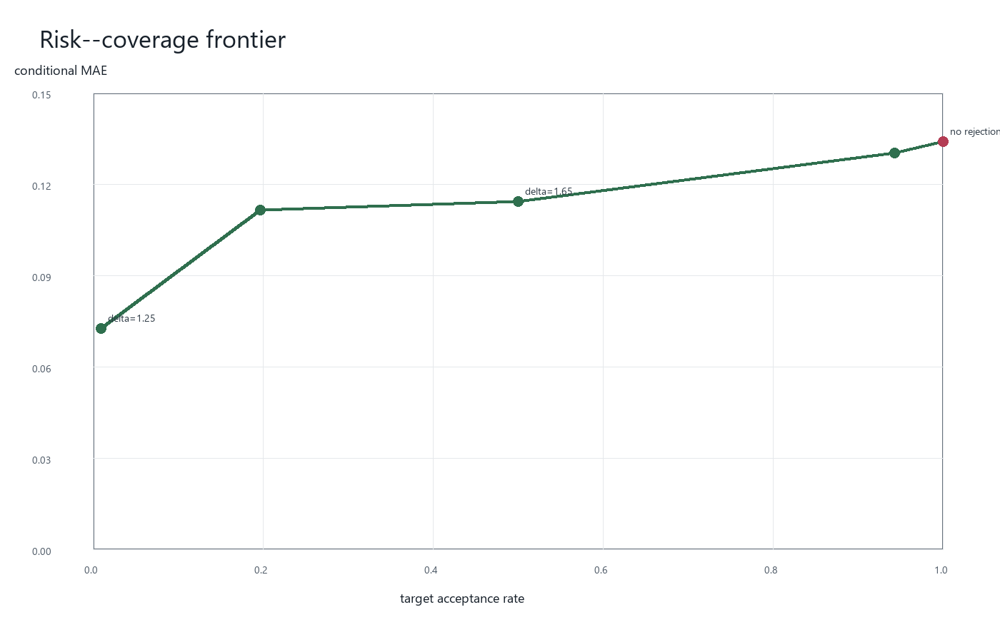
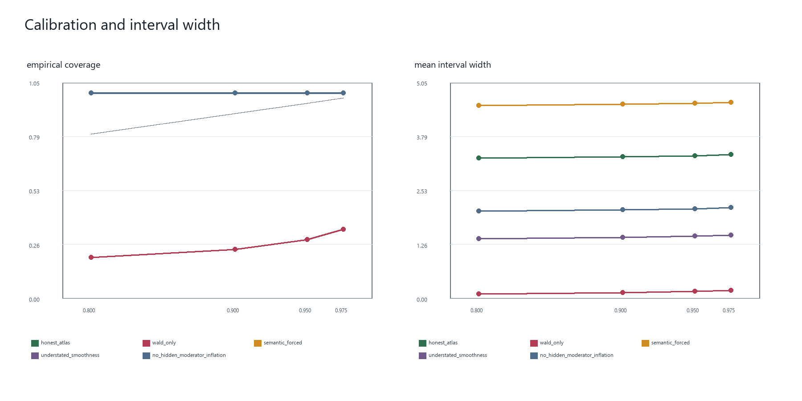

# Causal ATLAS 仿真实验总报告

## 1. 研究目的

本项目检验可拒绝 Causal ATLAS 在目标实验没有直接结果时，能否利用
历史随机实验的观测表示、设计档案、效应估计和不确定性证书进行因果
效应迁移，并在证据不足时拒绝发布不可靠的点预测。

方法层从未读取目标真值、真实机制或 oracle 支持权重。这些量只在完成
预测后用于仿真评价。

## 2. 数据生成与理论条件

基础机制为 m = (s1, s2, h, q)，其中 h 只通过有界误差代理公开。
所有实验采用已知概率 0.5 的 Bernoulli 随机化、共同设计档案和统一 ATE
尺度。效应曲面具有解析平滑界 L = 2.61、H = 1.80；AIPW 分数提供效应
估计和标准误证书。默认目标位于 archive 机制的凸包内，压力实验通过
向域内锚点作凸插值来增加语义失配，因此机制始终位于 [-1, 1]^4。

该构造逐项对应 Assumption 3.1--3.5。异质隐藏半径实验仍保持代理误差
包含关系；只有标记为 understated_smoothness 的策略故意向方法提供
错误的平滑常数，用于观察无效证书的后果。

## 3. 实验流程

项目的 12 个阶段是开发与验证阶段，不是 Algorithm 1 的 12 个步骤。
统一入口 run_algorithm1 先执行式 (4.2) 去偏、候选与兼容性筛选、式 (4.3)
权重和 Theorem 5.1 证书；接受时返回 Corollary 5.2 区间，拒绝时才构造
Theorem 5.4 部分识别并按 Definition 5.2 选择 bridge。逐行对照见
docs/algorithm1_alignment.md。

| 阶段 | 内容 | 核心产物 |
| --- | --- | --- |
| 1 | 最小数据生成与 3.1--3.5 自动证书 | minimal_dgp.md |
| 2 | 独立 Monte Carlo 重复与 oracle 管线检查 | monte_carlo.md |
| 3 | ATLAS、拒绝规则、消融和基线 | method_comparison.md |
| 4 | 四因素单因素扫描 | main_experiment.md |
| 5 | 三基准种子的正式实验和消融 | formal_experiment.md |
| 6 | 证书校准与失效边界 | calibration_experiment.md |

## 4. 主实验筛查结果

- 语义失配从 0 增至 0.25 时，ATLAS 接受率从 0.5150 降至 0.3000，接受样本 MAE 从 0.1118 升至 0.1361。
- 每实验样本量从 100 增至 1000 时，接受率从 0.2550 升至 0.6050。
- 隐藏调节变量证书半径和科学容忍度直接控制发布率，说明拒绝机制确实
  响应理论证书，而不是固定比例地选择样本。

## 5. 正式多种子结果

每个正式场景合并三个独立基准种子，每个种子 100 次重复，共 300 个
目标实验。名义场景结果如下。

| 方法 | 接受率 | 接受样本 MAE | RMSE | 区间覆盖率 |
| --- | ---: | ---: | ---: | ---: |
| atlas | 0.4633 | 0.1109 | 0.1375 | 1.0000 |
| atlas_no_rejection | 1.0000 | 0.1387 | 0.1703 | 1.0000 |
| semantic_forced | 1.0000 | 0.2241 | 0.2824 | 1.0000 |
| nearest_semantic | 1.0000 | 0.4557 | 0.5678 | 1.0000 |
| global_mean | 1.0000 | 0.2816 | 0.3621 | 1.0000 |

完整 ATLAS 的名义接受样本 MAE 为 0.1109，低于 no-rejection 的 0.1387；这只是选择事件条件下的风险，不能单独解释为对全体 target 的准确率提升。
在语义失配 0.25 下，ATLAS 接受率降至 0.2833；隐藏半径 0.40 时接受率为 0.0000。这些结果说明拒绝集中发生在
证书较大的困难目标上。

## 6. 证书校准与失效边界

archive 隐藏半径异质化后，正确 ATLAS 的发布率为 0.0300，总体区间覆盖仍为 1.0000。

在强语义失配下：

- 正确 ATLAS 仅发布 0.0433，发布区间覆盖为 1.0000；
- no-rejection 发布全部点，其中 0.9567 的证书半径已经超过科学容忍度；
- 低报平滑界也发布全部点，但覆盖降至 0.8333。

在严重语义失配下，低报平滑界的覆盖进一步降至 0.7233，而 no-rejection 有 0.9933 的发布点超过容忍度。

## 6A. Risk--coverage frontier

风险--覆盖率实验使用同一批 300 个 target，只改变证书阈值。阈值为 1.25、1.50、1.65、2.00 时，发布率为 0.0100、0.1967、0.5000、0.9433，对应条件MAE 为 0.0740、0.1136、0.1163、0.1327；acceptance=1 的 no-rejection 端点 MAE 为 0.1365。该图展示的是可拒绝估计器的 risk--coverage frontier，不能把任一条件 MAE 当作全体 target 上的无条件准确率。

## 6B. 覆盖率与区间宽度校准

正确证书在名义置信水平 0.80、0.90、0.95、0.975 下的经验覆盖率为 1.0000、1.0000、1.0000、1.0000，平均宽度从 3.2835 增至 3.3667。Wald-only 对照的覆盖率为 0.2000、0.2400、0.2867、0.3367，说明 coverage 必须和 width 联合报告。低报平滑界、semantic forced 和取消隐藏调节膨胀是诊断对照，不是具有完整理论保证的替代估计器。

## 7. 拒绝后的部分识别与 bridge

Theorem 5.4 实验中，名义支持场景的拒绝率为 0.5167，拒绝点平均部分识别宽度为 3.6462。严重失配时，拒绝率升至 0.9900，平均宽度升至 7.0760；全部拒绝分支区间覆盖率为 1.0000。

严重失配的 Definition 5.2 实验结果如下：

| bridge 策略 | 预算完成率 | 初始直径 | 最终直径 | 缩减比例 |
| --- | ---: | ---: | ---: | ---: |
| causal_greedy | 1.0000 | 6.9423 | 1.8772 | 0.7296 |
| semantic_greedy | 0.9667 | 6.9423 | 2.3309 | 0.6642 |
| random | 1.0000 | 6.9423 | 2.3167 | 0.6663 |

causal greedy 在全部路径用满预算；语义策略的规划证书不一致会单独记录，
不被当作零直径。该实验没有估计弱次模参数，因而不证明 Theorem 5.6 的
近似系数。

在小规模 12 候选穷举基准中，预算 1、2、3 时 causal greedy 的 bridge value / 穷举最优 value 比例为 0.9957、0.9776、0.9857。穷举最优使用已经观测到的bridge 结果，只是事后评价基准，既不可部署，也不构成对 Theorem 5.6 条件的证明。

## 8. 可以支持的结论

1. 在当前满足理论条件的合成机制中，完整证书区间保持保守覆盖。
2. 拒绝规则会优先筛除高误差、高证书半径的目标，接受样本误差低于
   强制发布版本。
3. 语义失配、隐藏不确定性和小样本都会降低可迁移性。
4. 错误低报平滑界会导致过度发布和覆盖率下降，证书有效性依赖于其
   常数确实有效。

## 9. 不能支持的结论与局限

这些结果不能证明真实世界泛化性能，也不能把 oracle 支持实验当作
可部署结果。当前 archive 数量固定为 8，效应曲面和随机化机制均为
预先指定；真实数据中的表示误差、设计不兼容和 nuisance estimation
误差仍需单独研究。覆盖率 1.0000 说明证书在该 DGP 下较保守，不等于
区间宽度已经最优。

## 10. 复现命令

    python -m unittest discover -s tests -v
    python scripts/run_sanity_check.py
    python scripts/run_algorithm1.py
    python scripts/run_monte_carlo.py
    python scripts/run_method_comparison.py
    python scripts/run_main_experiment.py
    python scripts/run_formal_experiment.py
    python scripts/run_calibration_experiment.py
    python scripts/run_risk_coverage_experiment.py
    python scripts/run_calibration_curve_experiment.py
    python scripts/run_partial_identification_experiment.py
    python scripts/run_minimax_experiment.py
    python scripts/run_bridge_experiment.py
    python scripts/run_bridge_optimality_experiment.py
    python scripts/run_nsw_experiment.py
    python scripts/build_final_report.py
    python scripts/build_paper_artifacts.py

结果文件、配置、图表及其 SHA-256 校验值见
results/experiment_manifest.json。
