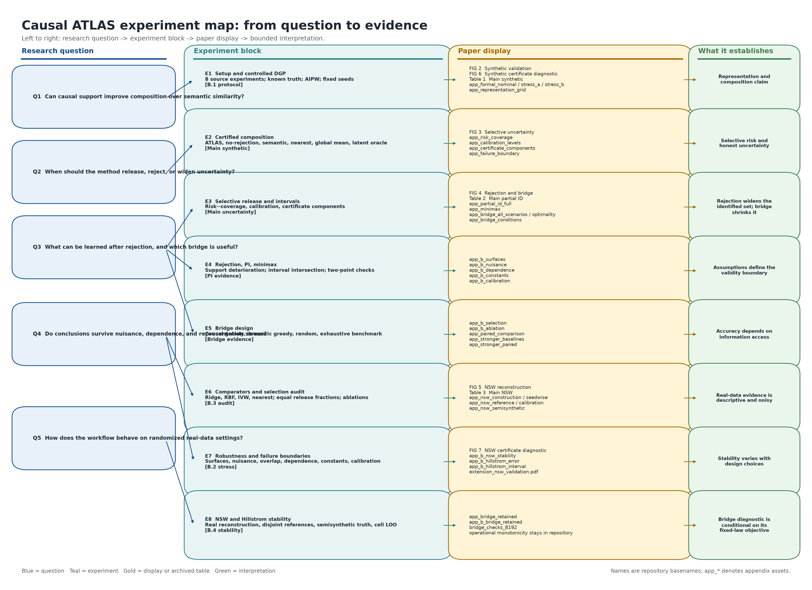

# 实验地图

这张图把当前论文的实验部分按“研究问题 → 实验协议 → 论文图表 → 可支持的结论”排开。箭头表示证据关系：左侧问题决定实验设计，中间实验产生右侧图表和表格，最右侧只写这些结果能够支持的有限判断。

图中 `FIG 2--5` 和 `Table 1--3` 是正文展示，`FIG 6--7` 是附录诊断图；`app_*` 是附录或仓库归档表的文件名缩写。附录表分别承担协议透明度、稳健性边界、比较审计、真实数据构造和 bridge 稳定性等核查任务。

建议沿三条路径阅读：

1. 从 E2 到 Figure 2 和 Table 1，看因果表示是否改善合成组合。
2. 从 E3 到 Figure 3，再到 B.2 的压力表，看发布和区间是否随证书条件变化。
3. 从 E4、E5 到 Figure 4，再看 B.5 的固定分布诊断，理解拒绝之后如何形成区间和选择下一项实验。

NSW 和 Hillstrom 位于底部，因为它们主要承担外部稳定性和构造敏感性检查；它们的参考量带有抽样噪声，不能直接解释为真实跨研究因果外推的证明。Bridge 的 operational monotonicity 诊断保留在仓库中，但没有放入论文展示，图中也标注了这一边界。

生成脚本为 `scripts/build/build_experiment_map.py`，输出 PNG 和 PDF 到本目录的 `figures/`。重新生成只依赖 Matplotlib，不会读取或改写实验 CSV，也不会修改论文源稿。
