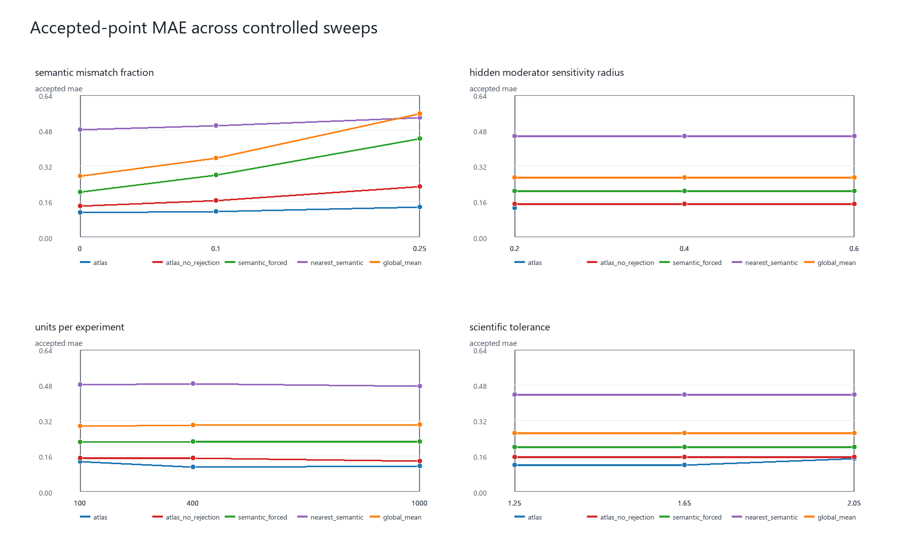
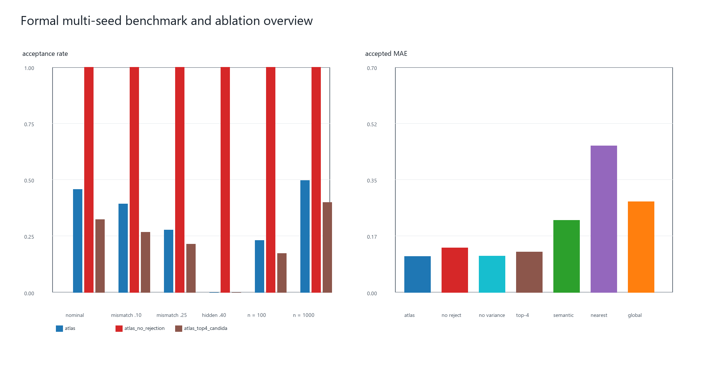
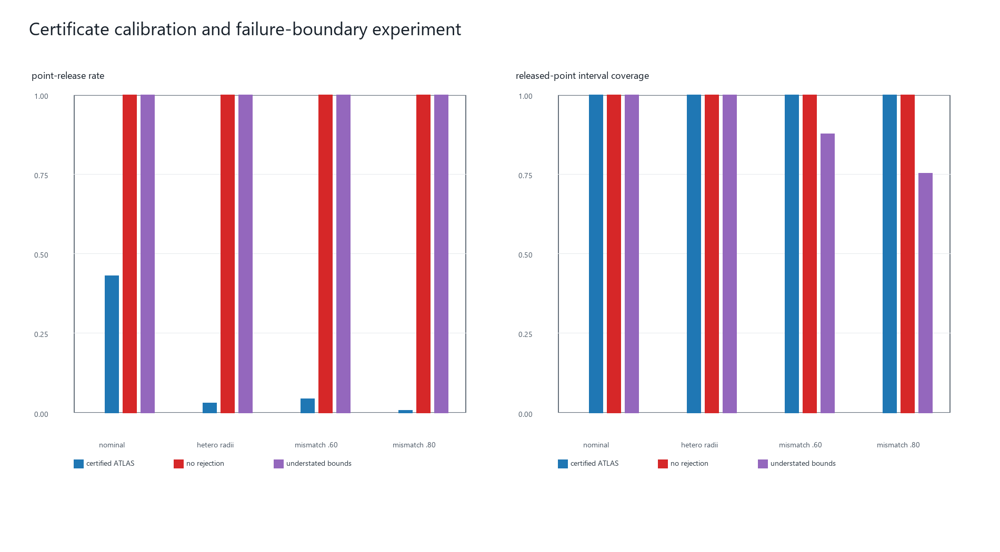

# 论文实验结果写作稿

本文件由已提交的结果 CSV 自动生成，供论文的仿真实验章节直接改写和引用。
数值均保留四位小数；不重新运行仿真，也不读取目标实验的真实效应。

## 实验设计与报告原则

所有实验使用满足 Assumption 3.1--3.5 的最小数据生成机制。正式基准实验
包含 6 个预先定义的情景、3 个独立基准种子，以及每个种子 100 次重复。
对每个 target，所有比较方法共享同一份 archive-target 抽样；目标真值仅在
方法输出后用于评价。可拒绝方法同时报告发布率和已发布点上的误差，避免把拒绝
当作无代价的性能提升。

## 主结果：受控参数扫描

图 1 展示四个单因素扫描中的已发布点 MAE。随着语义失配从 0 增至 0.25，
Causal ATLAS 的发布率从 0.5150 降至 0.3000，而已发布点 MAE 仍保持在较低水平。样本量从 100 增至 1000 时，发布率从 0.2500 升至 0.6050。这与证书半径随统计与表征不确定性变化而调整的设计一致。

## 正式多种子比较与消融

在名义情景中，Causal ATLAS 的发布率为 0.4567，已发布点 MAE 为 0.1111；去除拒绝规则后，所有点均被发布，MAE 上升至 0.1388。语义强制组合和最近语义邻居的 MAE 分别为 0.2241 与 0.4557，说明仅使用语义距离不足以替代设计兼容性和证书筛选。在语义失配 0.25 时，ATLAS 发布率为 0.2767；当隐藏调节不确定性半径为 0.40 时，发布率为 0.0000，即方法对证据不足的 target 选择拒绝。

## 证书校准与失效边界

在强语义失配下，正确证书的 ATLAS 仅发布 0.0433 的点，已发布区间覆盖率为 1.0000。相同场景下，无拒绝策略发布全部点，其中 0.9567 的点的证书半径超过科学容忍度。作为故意违反理论前提的反例，严重失配且低报平滑界时，发布区间覆盖率降至 0.7533。因此，这个边界实验支持的结论是：证书有用的前提是其上界确实有效，而不是任何数值化的置信区间都会自动保证可靠发布。

## 可引用结论与限制

当前结果支持：在这个满足理论假设的合成 DGP 中，拒绝机制会优先保留较低误差的
点预测，并在高不确定性区域减少发布；完整证书在预设情景下保持保守覆盖。
它们不支持对真实世界的泛化结论，也不能说明当前区间宽度最优。真实数据应用仍需
单独处理表征误差、设计不兼容和 nuisance estimation 误差。

LaTeX 表格位于 results/tables/paper_results_tables.tex，其中仅使用已保存的
正式多种子和失效边界结果。
