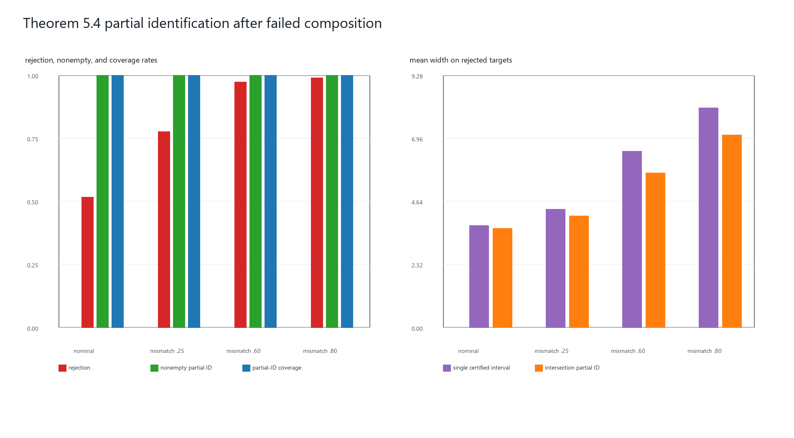

# 阶段9：失败组合后的部分识别实验

## 理论目标

本阶段对应 Algorithm 1 第 8--9 行、Definition 5.1 和 Theorem 5.4。阶段 3 的
组合证书超过科学容忍度以后，统一入口才进入本分支；如果组合被接受，
`partial_interval=None`，不会额外构造一个部分识别区间。点组合被拒绝时，
被拒绝时，方法不应强行发布一个点，而应对有限的设计兼容权重集合分别构造
Theorem 5.1 区间，并取交集：

\[
\widehat{\mathcal I}_A(e^\star)
=
\bigcap_{\alpha\in\mathcal W_A(e^\star)}
\left[
\sum_j\alpha_j\widehat\tau_j-B(\alpha,\zeta_\alpha),
\sum_j\alpha_j\widehat\tau_j+B(\alpha,\zeta_\alpha)
\right].
\]

总失败概率为 0.05，并平均分配到实际保留的权重向量，使
\(\sum_\alpha\zeta_\alpha=0.05\)。当前固定权重族包含：

1. 基于观测表征、方差和隐藏调节半径优化的 support 权重；
2. 全部设计兼容 archive 的均匀权重；
3. 四个最近设计兼容语义邻居的 singleton 权重。

重复权重会被删除，再根据实际权重数量重新分配失败概率。若交集为空，则按照
Lemma 5.1 将其解释为 archive 估计和证书在该置信水平下相互不一致，而不是返回
伪造的区间。

## 信息边界

部分识别方法只读取设计卡、观测表征、archive 效应估计、标准误和证书常数。
target 真值、真实机制和生成时的 oracle support 权重均不进入方法。

仿真完成后才使用真实机制计算 target 到设计兼容 archive 凸包的距离
\(r_0\)，并报告 Theorem 5.4 证明构造中的分离量
\(\min\{Lr_0,M\}\)。这里 \(L=2.61\)，全局效应绝对值上界取
\(M=3.88\)。这两个量仅用于评价非识别程度。

## 固定实验协议

- 场景：shift fraction 分别为 0、0.25、0.60 和 0.80；
- archive 数量：8；
- 每个 archive 与 target 的单位数：400；
- 独立基准种子：20260911、20260912、20260913；
- 每个种子、每个场景重复 100 次；
- 总 target 数：4 × 3 × 100 = 1,200；
- 点发布科学容忍度：1.65；
- 部分识别总失败概率：0.05。

## 结果

| 场景 | 拒绝率 | 交集非空率 | 总体覆盖率 | 拒绝点覆盖率 | 拒绝点交集宽度 | 单权重参考宽度 | 宽度收缩 | oracle 凸包距离 |
| --- | ---: | ---: | ---: | ---: | ---: | ---: | ---: | ---: |
| nominal | 0.5167 | 1.0000 | 1.0000 | 1.0000 | 3.6462 | 3.7518 | 0.0274 | 0.0000 |
| mismatch 0.25 | 0.7767 | 1.0000 | 1.0000 | 1.0000 | 4.0945 | 4.3425 | 0.0514 | 0.1325 |
| mismatch 0.60 | 0.9733 | 1.0000 | 1.0000 | 1.0000 | 5.6743 | 6.4837 | 0.1143 | 0.6471 |
| mismatch 0.80 | 0.9900 | 1.0000 | 1.0000 | 1.0000 | 7.0760 | 8.0676 | 0.1125 | 0.9974 |

## 解释

首先，全部交集保持非空且覆盖率为 1.0000，说明当前有效证书下的
Theorem 5.4 构造在该 DGP 中较为保守。覆盖率 1.0000 不代表区间最优或理论覆盖
必然等于 1，而是说明当前 1,200 次重复没有观察到漏覆盖。

其次，语义 shift 增大时，oracle 凸包距离、拒绝率和部分识别宽度同步增加。
严重失配下，ATLAS 几乎总是拒绝点发布，但仍返回覆盖真值的集合。这正是
“失败组合不是失败方法”的操作含义：区间宽度量化 archive 缺少多少支持。

最后，多权重交集相对于同一 Bonferroni 水平下的 support-optimized 单区间缩短
约 2.7%--11.4%。该收缩不是免费增加信息，而是把多个同时有效的 archive 约束
合并起来。

## 限制

本阶段没有证明 minimax 最优性。它提供 Algorithm 1 拒绝分支的初始区域，阶段 11
才在这个区域上运行 bridge design。oracle 凸包距离
只在仿真评价中可用；真实应用必须通过观测证书判断支持不足。拒绝后的条件覆盖率
还受到选择事件影响，因此论文结论应以无条件部分识别覆盖率为主。

## 复现

    python scripts/run_partial_identification_experiment.py
    python -m unittest discover -s tests -v

结果文件位于 results/partial_identification_*.csv、对应 metadata JSON、
results/tables/partial_identification_tables.md 和
results/figures/partial_identification_overview.png。

完整逐行映射见 `docs/algorithm1_alignment.md`。
