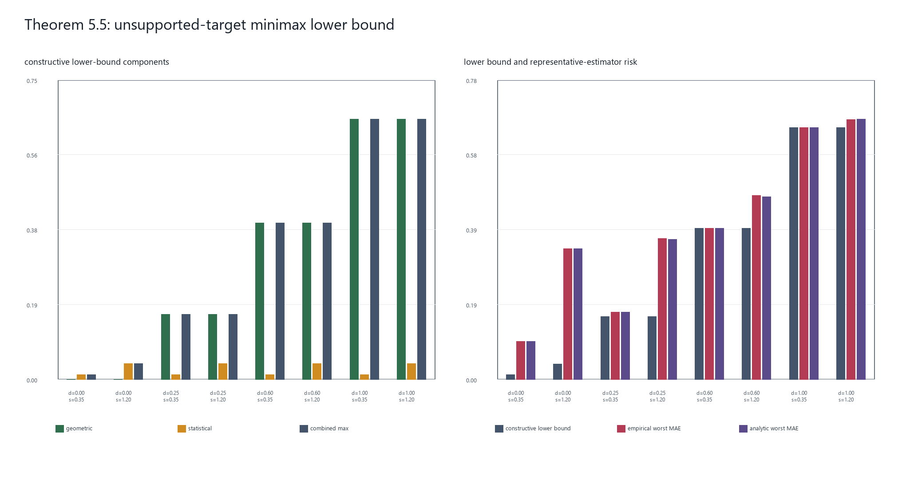

# Stage 10：unsupported-target minimax 下界实验

本阶段对应 Theorem 5.5，是对 Algorithm 1 为什么在支持不足时拒绝外推的理论
下界说明，不是 Algorithm 1 伪代码内部的一行，也不被 `run_algorithm1(...)`
调用。

## 理论目标

本阶段对应论文 Theorem 5.5。对绝对误差损失，定理给出的 minimax 风险尺度为

\[
R^\star \gtrsim
\max\left\{
\min(Ld_\star,M),
\min\left[\left(\sum_j s_j^{-2}\right)^{-1/2},M\right]
\right\}.
\]

其中，\(d_\star\) 是 target 机制到设计兼容 archive 凸包的距离，\(L\) 是
效应曲面的 Lipschitz 界，\(M\) 是效应绝对值界，\(s_j\) 是 archive 效应估计的
标准误。实验使用前面 DGP 已验证的保守常数 \(L=2.61\) 和 \(M=3.88\)。

需要区分“定理的量级表达”和“本实验使用的证明常数”。本阶段把证明中的两个
二点构造直接实例化，报告

\[
B_{\mathrm{geo}}=\frac14\min(Ld_\star,M),
\qquad
B_{\mathrm{stat}}=\frac{c_1(1-c_1)}2
\min(I^{-1/2},M),
\]

其中 \(I=\sum_j s_j^{-2}\)，固定 \(c_1=0.25\)，所以统计项系数为
\(0.09375\)。最终构造下界为
\(B_{\mathrm{combined}}=\max(B_{\mathrm{geo}},B_{\mathrm{stat}})\)。

## 两个证明子模型

### 几何不可识别对

将所有 archive 机制放在一维机制轴的 0 点，将 target 放在 \(d_\star\) 处。令

\[
a=\frac14\min(Ld_\star,M),\qquad
\mu_\pm(x)=\pm a\,\operatorname{clip}(x/d_\star,0,1).
\]

当 \(d_\star=0\) 时令两条曲面都为 0。两条曲面在所有 archive 机制处都取 0，
因此 archive 分布完全相同；在 target 处则分别取 \(+a\) 和 \(-a\)。其
Lipschitz 常数不超过 \(L/4\)，绝对值不超过 \(M/4\)。任何只读取 archive 的
估计器都无法区分这两个世界，三角不等式给出最坏绝对风险至少为 \(a\)。

### 高斯统计对

取两条常数曲面 \(\mu_t(m)=t\)，其中

\[
t\in\{-\delta,+\delta\},\qquad
\delta=c_1\min(I^{-1/2},M).
\]

第 \(j\) 个 archive 观测满足
\(\widehat\tau_j\sim N(t,s_j^2)\)。Pinsker/Le Cam 二点论证控制两种联合分布的
可区分度，并给出 \(B_{\mathrm{stat}}\)。该子模型隔离了有限 archive 精度造成的
统计困难，与 target 是否在凸包内无关。

## 固定实验协议

- hull distance：\(d_\star\in\{0,0.25,0.60,1.00\}\)；
- archive 数量：8；
- archive 标准误：精确档 \(s_j=0.35\)，噪声档 \(s_j=1.20\)；
- 场景数：4 个距离 × 2 个噪声档 = 8；
- 独立基准种子：20261011、20261012、20261013；
- 每个种子、每个场景重复 100 次；
- 总重复数：8 × 3 × 100 = 2,400；
- 损失：target 效应的绝对误差。

为了给下界一个可核对的风险参照，实验同时运行 inverse-variance archive mean：

\[
\widehat\tau_{\mathrm{IVW}}
=\frac{\sum_j s_j^{-2}\widehat\tau_j}{\sum_j s_j^{-2}}.
\]

该估计器不是论文声称的 minimax 最优估计器，也不是新的 ATLAS 版本。它只用于
展示一个具体估计器在两个证明子模型上的最坏 MAE，并与其可解析高斯风险对照。

## 结果

| 场景 | 构造下界 | 经验最坏 MAE | 解析最坏 MAE | 经验风险/下界 | 跨种子 SD |
| --- | ---: | ---: | ---: | ---: | ---: |
| d=0.00, s=0.35 | 0.0116 | 0.0989 | 0.0987 | 8.5243 | 0.0037 |
| d=0.00, s=1.20 | 0.0398 | 0.3391 | 0.3385 | 8.5243 | 0.0125 |
| d=0.25, s=0.35 | 0.1631 | 0.1739 | 0.1740 | 1.0659 | 0.0050 |
| d=0.25, s=1.20 | 0.1631 | 0.3647 | 0.3632 | 2.2358 | 0.0115 |
| d=0.60, s=0.35 | 0.3915 | 0.3918 | 0.3916 | 1.0008 | 0.0047 |
| d=0.60, s=1.20 | 0.3915 | 0.4767 | 0.4732 | 1.2175 | 0.0193 |
| d=1.00, s=0.35 | 0.6525 | 0.6528 | 0.6525 | 1.0005 | 0.0047 |
| d=1.00, s=1.20 | 0.6525 | 0.6741 | 0.6753 | 1.0331 | 0.0160 |



当 \(d_\star=0\) 时，几何项为 0，正下界完全来自有限信息量。把标准误从 0.35
增至 1.20 后，统计构造下界和估计器风险都按 \(I^{-1/2}\) 增长。当
\(d_\star\ge 0.25\) 时，当前参数下几何项成为构造下界的最大分量；距离增大时，
不可识别的 target 分离量同步增长。

全部场景的经验最坏 MAE 均不低于构造下界，且与解析高斯风险接近。距离为 0.60
和 1.00、archive 较精确时，具体估计器的风险几乎贴住几何构造下界；这不是证明
全模型的常数已经最优，只说明几何不可识别项在这些设置下主导风险。

## 信息边界与限制

本实验是 Theorem 5.5 证明构造的数值说明，不是对 minimax 定理的数值证明。
它只研究完整模型类中的两个高斯限制子模型，没有搜索所有数据生成机制或所有
估计器，也不能把经验风险与理论下界接近解释成全局 minimax 最优性。固定的
\(1/4\) 和 \(0.09375\) 是方便审计的构造常数；定理正文的 \(\gtrsim\) 只声明
存在通用常数。

本阶段也没有实现 bridge design 或真实数据分析。bridge 能否降低
\(d_\star\) 及其成本收益，是下一阶段要单独研究的问题。

## 复现

```powershell
python scripts/run/run_minimax_experiment.py
python -m unittest discover -s tests -v
```

结果位于 `results/minimax_experiment_*.csv`、对应 metadata JSON、
`results/tables/minimax_experiment_tables.md` 和
`results/figures/minimax_experiment_overview.png`。
